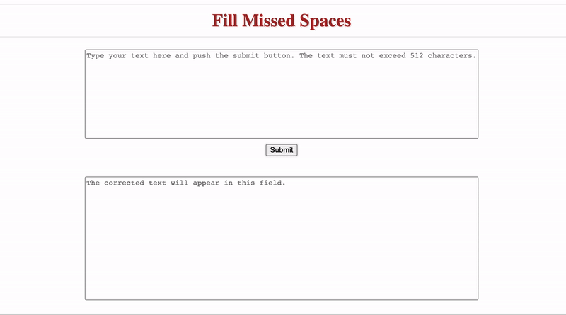

# Fill-Missed-Spaces
HTTP service that receives text with missed spaces and returns a corrected sentence and a list of missed spaces positions. 

The algorithm reconstructs the string using its tokenized representation. The tokenization algorithm is based on dynamic programming and probabilistic unigram model with a predefined vocabulary.

### Installation
Clone the repository:
```
$ git clone https://github.com/artem-gorodetskii/Fill-Missed-Spaces.git
```

To run in a base or virtual environment:
```
$ cd Fill-Missed-Spaces
$ pip install -r requirements.txt
$ python app.py
```

To run as a docker container:
```
$ cd Fill-Missed-Spaces
$ docker build ./ -t fill-missed-spaces
$ docker run -it -p 5100:5100 -d fill-missed-spaces
```

### Usage
**Request example**
``` python
import requests

# compose request as dictionary {'text': <your text>}
request = {'text': 'Theladysoon appeared,presentinga mostcharmingspectacleofperfectbeauty,set off bythemost appropriateadornments.'}

# send to http://127.0.0.1:5100/predict_spaces
result = requests.post('http://127.0.0.1:5100/predict_spaces', json=request).json()

# the server response is a JSON file with "text" and "missed_spaces" fields
print(result)
```
``` bash
{
  'missed_spaces': [3, 8, 23, 34, 41, 50, 60, 63, 71, 79, 90, 94, 111],
  'text': 'The lady soon appeared, presenting a most charming spectacle of perfect beauty, set off by the most appropriate adornments.'
 }
```
If the text length exceeds 512 characters, the service raises the REQUEST_ENTITY_TOO_LARGE error.

**Checking the health**

To ping the service, you can use curl as follows:
```
$ curl http://127.0.0.1:5100/healthcheck
```

**Application interface**

To access the application visit the following URL:
```
http://127.0.0.1:5100/
```
You will see an interface with text fields and a submit button. Type your text in the top text field and click Submit. The service response will then appear in the bottom text box. You can see an example in the figure below.

<p align="center">
  
  <br>
</p>
